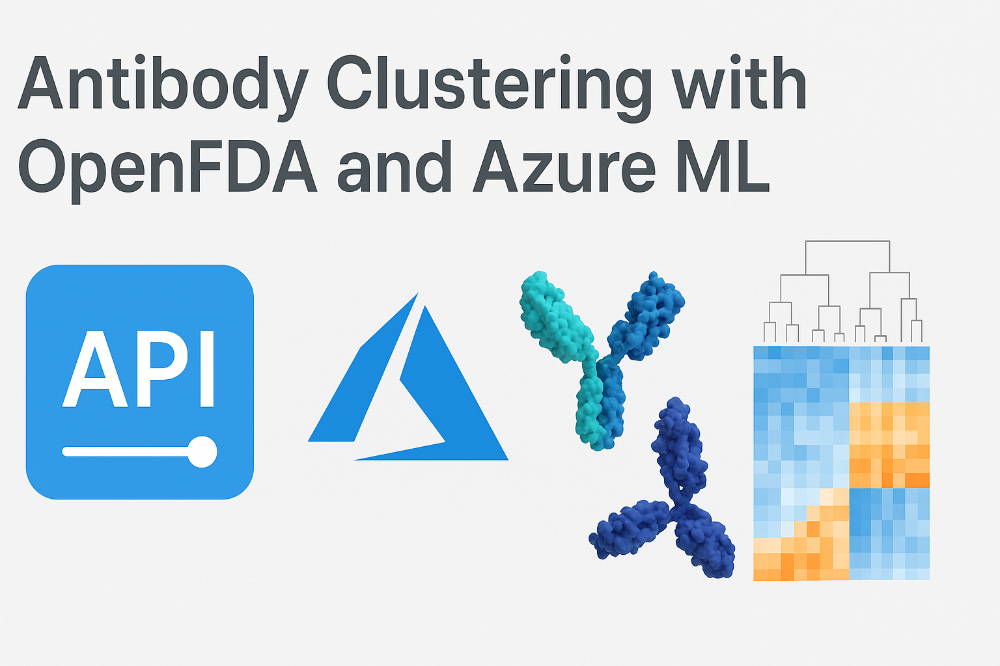

# OpenFDAAPI-Azure-Antibody-RWE-MLClustering

This repository demonstrates the integration of the OpenFDA API with Azure services to process and analyze antibody-related Real-World Evidence (RWE) data. It provides a full pipeline from data ingestion to machine learning model deployment.

---

## 🧱 Architecture Overview

The system architecture facilitates seamless data flow from raw ingestion to actionable insights:

- **Data Ingestion**: Azure Blob Storage collects raw data from the OpenFDA API.
- **Data Processing Layers**:
  - **Bronze Layer**: Raw, unprocessed Parquet files.
  - **Silver Layer**: Cleaned and transformed data.
  - **Gold Layer**: Aggregated and enriched data ready for ML modeling.
- **Machine Learning**: Training of clustering models using Gold Layer data.
- **Deployment Pipelines**: Automated workflows defined in JSON pipeline templates.

Architecture Diagram

---

## 🧪 Data Science Workflow

The workflow follows these main steps:

Click to expand

1. **Data Collection**: Fetches adverse event data from the OpenFDA API.
2. **Data Transformation**:
   - [ParquetToCSV.ipynb](https://github.com/camontefusco/OpenFDAAPI-Azure-Antibody-RWE-MLClustering/blob/notebooks/ParquetToCSV.ipynb): Convert Parquet to CSV.
   - [Notebook1BronzeNewtoSilverProcessing.ipynb](https://github.com/camontefusco/OpenFDAAPI-Azure-Antibody-RWE-MLClustering/blob/notebooks/Notebook1BronzeNewtoSilverProcessing.ipynb): Bronze → Silver processing.
   - [PrepareGoldForML.ipynb](https://github.com/camontefusco/OpenFDAAPI-Azure-Antibody-RWE-MLClustering/blob/notebooks/PrepareGoldForML.ipynb): Prepare Gold layer for ML.
   - [ProcessGoldToCurated.ipynb](https://github.com/camontefusco/OpenFDAAPI-Azure-Antibody-RWE-MLClustering/blob/notebooks/ProcessGoldToCurated.ipynb): Curate Gold layer.
3. **Model Training**:
   - [TrainGoldMLModel.ipynb](https://github.com/camontefusco/OpenFDAAPI-Azure-Antibody-RWE-MLClustering/blob/notebooks/TrainGoldMLModel.ipynb): Clustering model training.
4. **Evaluation & Deployment**: Model validation and deployment pipelines.

---

## 🛠️ Technologies & Skills

- **Languages**: Python  
- **Data Processing**: Azure Blob Storage, Azure DataLake Gen2, Azure Synapse Analytics, Parquet, Pandas  
- **Machine Learning**: Scikit-learn, K-means Clustering  
- **Deployment**: Azure Pipelines  
- **Visualization**: Matplotlib, Seaborn  

---

## 📸 Visual Documentation

Click to expand screenshots

- **Blob to Bronze**: 
- **Silver to Gold**: 
- **Daily Processing**: 

---

## 🔗 Pipelines

Click to expand JSON pipelines

- [BlobtoBronze.json](https://github.com/camontefusco/OpenFDAAPI-Azure-Antibody-RWE-MLClustering/blob/pipelines-(json)/BlobtoBronze.json)  
- [SilverToGold.json](https://github.com/camontefusco/OpenFDAAPI-Azure-Antibody-RWE-MLClustering/blob/pipelines-(json)/SilverToGold.json)  
- [Daily_processing.json](https://github.com/camontefusco/OpenFDAAPI-Azure-Antibody-RWE-MLClustering/blob/pipelines-(json)/daily_processing.json)  

---

## 📬 Contact
Carlos Montefusco
📧 cmontefusco@gmail.com
🔗 GitHub: /camontefusco
